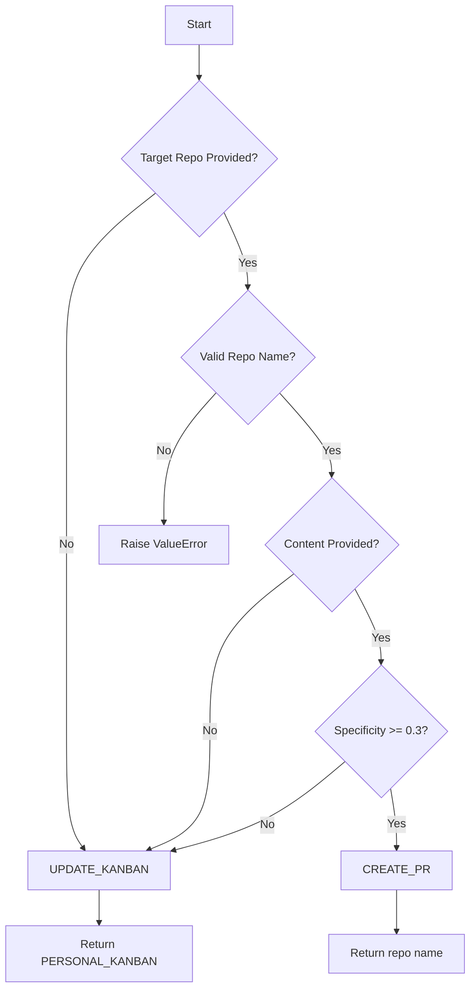

# PR Target Determiner

## Overview

A production-quality Python module that implements intelligent decision logic for routing DevOps workflow actions. Determines whether to create a Pull Request (PR) or update a personal Kanban board based on content analysis and user specifications.

## Features

### ✅ Core Capabilities

- **Intelligent Content Analysis**: Uses NLP heuristics to detect vague vs. specific technical content
- **Repository Validation**: Validates GitHub repository naming conventions
- **Robust Error Handling**: Comprehensive input validation and meaningful error messages
- **Production Logging**: Detailed audit trail for debugging and compliance
- **Type Safety**: Full type hints for IDE support and static analysis
- **Comprehensive Tests**: 22 unit tests covering all logic paths and edge cases

### 🔍 Content Vagueness Detection

The module analyzes content across multiple dimensions:

| Metric | Description | Weight |
|--------|-------------|--------|
| **Word Count** | Number of words in content | 20% |
| **Technical Terms** | Presence of programming/DevOps terminology | 30% |
| **Actionable Verbs** | Implementation-focused verbs (fix, implement, etc.) | 30% |
| **Code References** | Function calls, file paths, API endpoints, etc. | 20% |

**Specificity Score**: Weighted combination (0.0 - 1.0)
**Threshold**: Content with score < 0.3 is considered too vague for PR creation

## Installation

No external dependencies required - uses Python standard library only.

```bash
# Ensure Python 3.8+ is installed
python3 --version

# Module is ready to use
cd /path/to/Maestro/scripts
python pr_target_determiner.py  # Run standalone demo
```

## Usage

### Basic Import

```python
from pr_target_determiner import determine_pr_target

# Example 1: Specific content with target repo → CREATE_PR
result = determine_pr_target(
    raw_notes_content="Implement OAuth2 authentication flow with JWT tokens for user-service API",
    user_designated_target_repo="auth-backend"
)
print(result)
# Output: {'target_action': 'CREATE_PR', 'target_repo': 'auth-backend'}

# Example 2: Vague content → UPDATE_KANBAN
result = determine_pr_target(
    raw_notes_content="some ideas for later",
    user_designated_target_repo=None
)
print(result)
# Output: {'target_action': 'UPDATE_KANBAN', 'target_repo': 'PERSONAL_KANBAN'}
```

### Function Signature

```python
def determine_pr_target(
    raw_notes_content: Optional[str],
    user_designated_target_repo: Optional[str]
) -> PRTargetResult:
    """
    Args:
        raw_notes_content: User's note content (can be None or empty)
        user_designated_target_repo: Target GitHub repository name (can be None)

    Returns:
        Dictionary with keys:
        - target_action: "CREATE_PR" or "UPDATE_KANBAN"
        - target_repo: Repository name or "PERSONAL_KANBAN"

    Raises:
        ValueError: If repository name format is invalid
    """
```

## Decision Logic

### Routing Rules (Priority Order)



### Rules Summary

| Condition | Action | Target Repo |
|-----------|--------|-------------|
| ✅ Target repo + ✅ Specific content | `CREATE_PR` | User-designated repo |
| ✅ Target repo + ❌ Vague content | `UPDATE_KANBAN` | `PERSONAL_KANBAN` |
| ❌ No target repo (any content) | `UPDATE_KANBAN` | `PERSONAL_KANBAN` |
| ❌ Invalid repo name | `ValueError` | N/A |

## Content Analysis Examples

### ✅ Specific Content (Creates PR)

```python
# High technical density
"Implement OAuth2 authentication flow with JWT tokens for user-service API endpoints"
# Score: ~0.8

# Code references
"Refactor UserService.authenticate() method to use async/await pattern"
# Score: ~0.7

# File paths and actionable verbs
"Fix bug in payment_service/api.py where transactions fail silently"
# Score: ~0.6
```

### ❌ Vague Content (Routes to Kanban)

```python
# Too generic
"some ideas"
# Score: 0.0

# No technical context
"thinking about architecture"
# Score: 0.01

# Ambiguous intent
"maybe refactor later"
# Score: 0.14
```

## Running Tests

```bash
# Run full test suite
cd /home/user/Maestro/scripts
python test_pr_target_determiner.py

# Expected output:
# Ran 22 tests in 0.010s
# OK

# Using pytest (if installed)
python -m pytest test_pr_target_determiner.py -v
```

### Test Coverage

- ✅ Repository name validation (valid/invalid formats)
- ✅ Content analysis (technical terms, verbs, code patterns)
- ✅ Vagueness detection (various content types)
- ✅ Main function decision logic (all routing paths)
- ✅ Edge cases (None inputs, whitespace, empty strings)
- ✅ Error handling (invalid repo names)
- ✅ Integration scenarios (developer workflows)
- ✅ Boundary conditions (threshold values)

## Standalone Demo

```bash
# Run built-in demo with test cases
cd /home/user/Maestro/scripts
python pr_target_determiner.py

# Output: 6 example scenarios with detailed analysis
```

## Integration Example

### GitHub Actions Workflow Integration

```yaml
# .github/workflows/process-notes.yml
name: Process Developer Notes

on:
  workflow_dispatch:
    inputs:
      notes:
        description: 'Your notes or ideas'
        required: true
      target_repo:
        description: 'Target repository (optional)'
        required: false

jobs:
  route-action:
    runs-on: ubuntu-latest
    steps:
      - uses: actions/checkout@v3

      - name: Determine Target
        id: target
        run: |
          python3 << 'EOF'
          import sys
          import os
          import json
          sys.path.append('scripts')
          from pr_target_determiner import determine_pr_target

          notes = """${{ github.event.inputs.notes }}"""
          repo = "${{ github.event.inputs.target_repo }}" or None

          result = determine_pr_target(notes, repo)

          with open(os.environ['GITHUB_OUTPUT'], 'a') as f:
              f.write(f"action={result['target_action']}\n")
              f.write(f"repo={result['target_repo']}\n")
          EOF

      - name: Create PR
        if: steps.target.outputs.action == 'CREATE_PR'
        run: |
          echo "Creating PR in ${{ steps.target.outputs.repo }}"
          # Your PR creation logic here

      - name: Update Kanban
        if: steps.target.outputs.action == 'UPDATE_KANBAN'
        run: |
          echo "Adding to Kanban"
          # Your Kanban update logic here
```

### Python Script Integration

```python
#!/usr/bin/env python3
"""
Example: DevOps automation script
"""
import sys
sys.path.append('/home/user/Maestro/scripts')

from pr_target_determiner import determine_pr_target
import subprocess

def process_user_note(note: str, target: str = None):
    """Route user note to appropriate workflow."""

    # Determine routing
    result = determine_pr_target(note, target)

    if result['target_action'] == 'CREATE_PR':
        # Create PR via GitHub CLI
        repo = result['target_repo']
        subprocess.run([
            'gh', 'pr', 'create',
            '--repo', f'org/{repo}',
            '--title', note[:50],
            '--body', note
        ])
        print(f"✅ PR created in {repo}")

    else:
        # Update Kanban board
        # Your Kanban API integration here
        print(f"📋 Added to personal Kanban")

# Usage
if __name__ == '__main__':
    import argparse
    parser = argparse.ArgumentParser()
    parser.add_argument('note', help='Your notes')
    parser.add_argument('--repo', help='Target repository')
    args = parser.parse_args()

    process_user_note(args.note, args.repo)
```

## API Reference

### Main Function

#### `determine_pr_target(raw_notes_content, user_designated_target_repo)`

**Parameters:**
- `raw_notes_content` (Optional[str]): Note content to analyze
- `user_designated_target_repo` (Optional[str]): Target GitHub repository

**Returns:**
- `PRTargetResult`: TypedDict with `target_action` and `target_repo`

**Raises:**
- `ValueError`: Invalid repository name format

---

### Helper Functions

#### `validate_repository_name(repo_name)`

Validates GitHub repository naming conventions.

**Returns:** `bool`

---

### Classes

#### `ContentAnalyzer`

**Methods:**
- `analyze_content(content)` → `VaguenessMetrics`
- `is_content_too_vague(content)` → `bool`

**Class Attributes:**
- `MIN_WORD_COUNT = 10`
- `MIN_SPECIFICITY_SCORE = 0.3`
- `TECHNICAL_TERMS`: Set of recognized technical keywords
- `ACTIONABLE_VERBS`: Set of implementation verbs
- `CODE_PATTERNS`: Regex patterns for code detection

---

## Configuration

### Adjusting Thresholds

Edit class constants in `pr_target_determiner.py`:

```python
class ContentAnalyzer:
    # Minimum words for consideration (default: 10)
    MIN_WORD_COUNT = 10

    # Minimum specificity score (default: 0.3, range: 0.0-1.0)
    MIN_SPECIFICITY_SCORE = 0.3
```

### Adding Custom Technical Terms

```python
# Add domain-specific terms
ContentAnalyzer.TECHNICAL_TERMS.update({
    'kubernetes', 'helm', 'istio', 'grafana'
})
```

## Logging

### Enable Debug Logging

```python
import logging

# Set to DEBUG for detailed analysis
logging.basicConfig(level=logging.DEBUG)

from pr_target_determiner import determine_pr_target
```

### Log Output Format

```
2025-11-27 18:45:45,128 - pr_target_determiner - INFO - ======================================================================
2025-11-27 18:45:45,128 - pr_target_determiner - INFO - PR Target Determination - Starting Analysis
2025-11-27 18:45:45,128 - pr_target_determiner - INFO - ======================================================================
2025-11-27 18:45:45,128 - pr_target_determiner - INFO - Input - Target Repo: auth-backend
2025-11-27 18:45:45,128 - pr_target_determiner - INFO - Input - Content Length: 73 chars
2025-11-27 18:45:45,128 - pr_target_determiner - INFO - ✓ Valid repository name: auth-backend
2025-11-27 18:45:45,128 - pr_target_determiner - INFO - ✓ DECISION: CREATE_PR (designated repo + specific content)
2025-11-27 18:45:45,128 - pr_target_determiner - INFO - → Target Repository: auth-backend
```

## Troubleshooting

### Issue: All content marked as vague

**Solution:** Lower the `MIN_SPECIFICITY_SCORE` threshold or add domain-specific technical terms.

### Issue: ValueError for valid repo name

**Check:** Ensure repo name doesn't contain spaces, special characters, or exceed 100 characters.

### Issue: Short technical notes flagged as vague

**Solution:** The module prioritizes specificity score over word count. Ensure notes include:
- Technical terminology
- Actionable verbs
- Code references (file paths, function names)

## Performance

- **Execution Time**: < 1ms per analysis
- **Memory Usage**: < 1MB
- **Dependencies**: None (stdlib only)

## License

MIT License - Part of the Maestro DevOps Automation Project

## Contributing

Submit test cases via PR to improve content analysis heuristics.

## Changelog

### Version 1.0.0 (2025-11-27)

- Initial implementation
- 22 comprehensive unit tests
- Production logging and error handling
- Complete documentation
